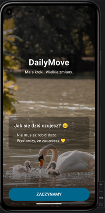
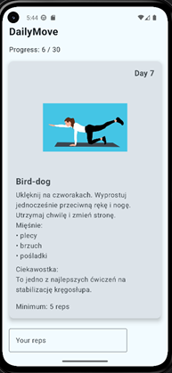
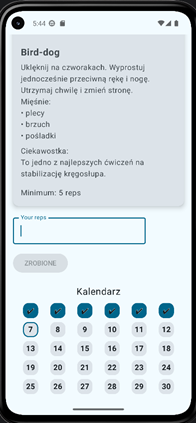

# 🌿 DailyMove

DailyMove to prosta aplikacja mobilna napisana w Kotlinie z użyciem Jetpack Compose.  
Jej celem jest wspieranie codziennej aktywności fizycznej oraz budowanie zdrowych nawyków w lekkiej, motywującej formie.

---

## ✨ Funkcje (MVP)

- Ekran startowy z prostym komunikatem motywacyjnym
- Sekcja „DailyMove” – małe kroki, wielkie zmiany
- Minimalistyczny, spokojny interfejs
- Projekt w fazie rozwoju (wersja 1.0 – MVP)

---

## 🎯 Cel aplikacji

Aplikacja powstała jako narzędzie wspierające:
- codzienną aktywność fizyczną
- budowanie nawyku ruchu
- poprawę samopoczucia bez presji
- prostotę i regularność zamiast perfekcji
- poznanie podstawowych ćwiczeń

---

## 🛠️ Technologie

- Kotlin
- Android Studio
- Jetpack Compose
- Material Design

---

## 🚀 Jak uruchomić projekt

1. Sklonuj repozytorium:
   ```bash
   git clone https://github.com/edelta27/DailyMove.git
2. Otwórz projekt w Android Studio
3. Poczekaj aż Gradle pobierze zależności
4. Uruchom aplikację na emulatorze lub telefonie

## 📸 Zrzuty ekranu 

Start Screen
 
Home Screen
 

## 📌 Status projektu

Projekt w trakcie rozwoju 🚧
Planowane są kolejne funkcje:

- dziennik aktywności
- śledzenie postępów
- bardziej rozbudowany system motywacji
- więcej ćwiczeń